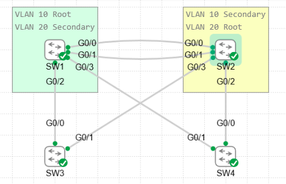
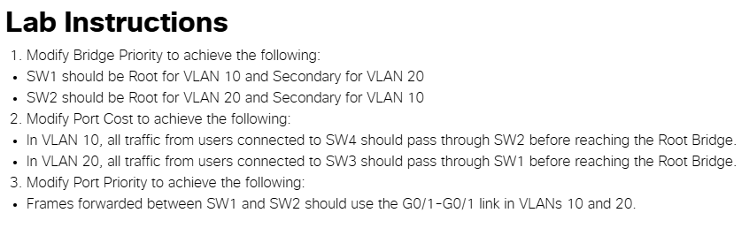
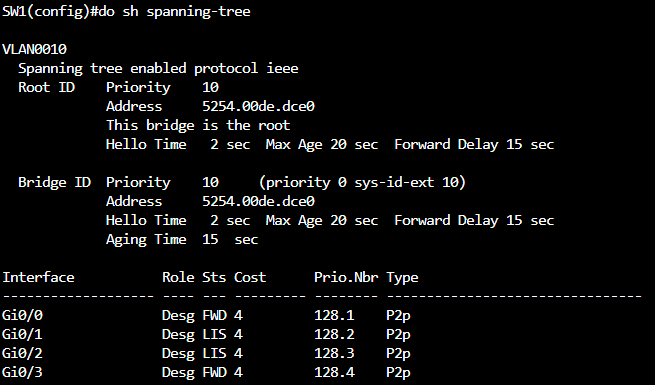
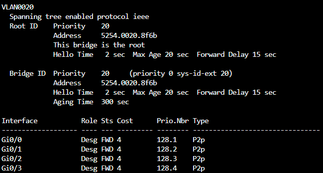
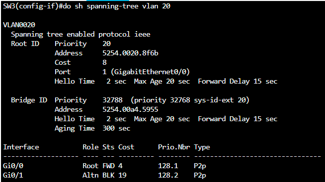
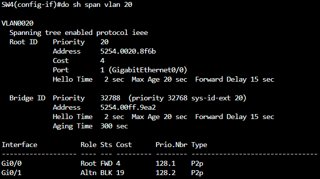
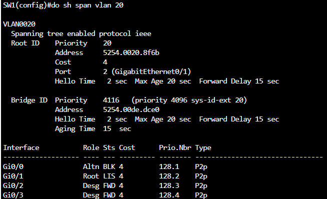
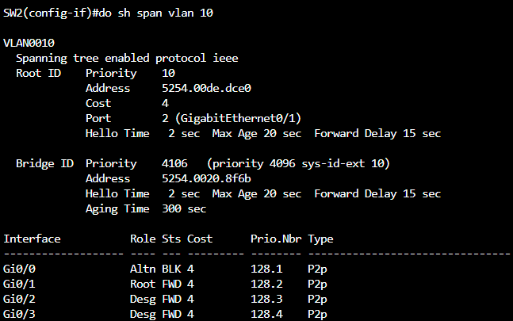

# STP Tuning Lab 

This lab demonstrates Spanning Tree Protocol (STP) tuning across a four-switch topology using bridge priority, port cost, and port priority to control root bridge election and forwarding paths for VLAN 10 and VLAN 20.

## Topology

The topology consists of four switches:

- **SW1** and **SW2** are interconnected via two links (G0/0–G0/0 and G0/1–G0/1) and each connect down to SW3 and SW4.
- **SW3** connects to both SW1 (G0/0) and SW2 (G0/1).
- **SW4** connects to both SW1 (G0/1) and SW2 (G0/0).
- SW3 and SW4 are left at default STP bridge priority.

| Switch | VLAN 10 Role | VLAN 20 Role |
|--------|--------------|--------------|
| SW1    | Root         | Secondary Root |
| SW2    | Secondary Root | Root       |
| SW3    | Default priority | Default priority |
| SW4    | Default priority | Default priority |

## Lab Objectives

1. **Modify Bridge Priority**
   - SW1 is Root for VLAN 10 and Secondary Root for VLAN 20.
   - SW2 is Root for VLAN 20 and Secondary Root for VLAN 10.
2. **Modify Port Cost**
   - In VLAN 10, traffic from SW4 must pass through SW2 before reaching the Root Bridge.
   - In VLAN 20, traffic from SW3 must pass through SW1 before reaching the Root Bridge.
3. **Modify Port Priority**
   - Frames forwarded between SW1 and SW2 must use the G0/1–G0/1 link in both VLAN 10 and VLAN 20.

## Configuration

Relevant STP configuration for each switch is in [`configs/`](configs/):

- [`SW1.txt`](configs/SW1.txt)
- [`SW2.txt`](configs/SW2.txt)
- [`SW3.txt`](configs/SW3.txt)
- [`SW4.txt`](configs/SW4.txt)

## Verification

